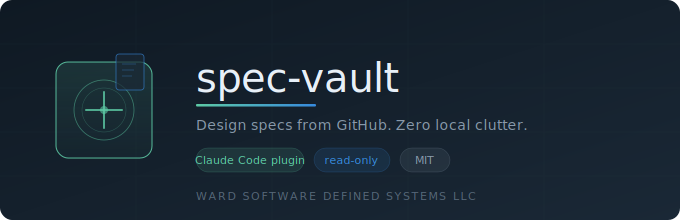

<p align="center">
  
</p>

# spec-vault

A Claude Code plugin that fetches transient spec and design documents from a private GitHub repo during implementation — no local file clutter, no `.gitignore` juggling.

**Built for research-then-implement workflows** where design documents are produced in one phase and consumed in another, then archived when implementation is complete.

## The Problem

If you produce design specs, architecture docs, or implementation guides before coding (whether via Claude.ai, a design review, or any other process), you need those documents accessible to your coding tools. The typical approach — copying spec files into your working tree and adding them to `.gitignore` — creates manual overhead, clutter, and the risk of accidentally committing transient files.

## The Solution

spec-vault connects Claude Code to a private GitHub repo (your "spec vault") where design documents live. Claude Code reads specs on demand via the GitHub MCP Server — nothing is copied into your working tree.

- **`ACTIVE/`** specs are available for current work
- **`COMPLETED/`** specs are archived after implementation
- You control what gets loaded via `/spec-vault:specs`

## Quick Start

### 1. Create Your Spec Vault Repo

Create a private GitHub repo with this structure:

```
your-spec-vault/
├── ACTIVE/
│   ├── project-a/
│   │   ├── FEATURE-SPEC.md
│   │   └── API-DESIGN.md
│   └── project-b/
│       └── MIGRATION-PLAN.md
├── COMPLETED/
│   └── project-a/
│       └── INITIAL-SETUP.md
└── README.md
```

### 2. Create a GitHub PAT

Create a [fine-grained Personal Access Token](https://github.com/settings/tokens?type=beta) with:
- **Repository access**: Only select your spec vault repo
- **Permissions**: Contents → Read-only

### 3. Set Environment Variables

```bash
# Required
export SPEC_VAULT_GITHUB_TOKEN="github_pat_xxxxx"

# Optional (defaults shown)
export SPEC_VAULT_REPO="your-org/your-spec-vault"    # owner/repo format
export SPEC_VAULT_BRANCH="main"
export SPEC_VAULT_ACTIVE_DIR="ACTIVE"
export SPEC_VAULT_COMPLETED_DIR="COMPLETED"
```

Add these to your shell profile (`~/.zshrc`, `~/.bashrc`, etc.) for persistence.

### 4. Install the Plugin

**(COMING SOON) From the marketplace:**
```
/plugin install spec-vault@claude-plugin-directory
```

**From GitHub (for development/testing):**
```bash
git clone https://github.com/ward-software-defined-systems/spec-vault.git
claude --plugin-dir ./spec-vault
```

### 5. Plan Mode Setup (Important!)

If you use Plan Mode — and you should for spec-driven work — add the spec-vault tools to your permissions allow list. Without this, MCP tools are auto-denied in Plan Mode.

Add to `~/.claude/settings.json` (user-level) or `.claude/settings.json` (project-level):

```json
{
  "permissions": {
    "allow": [
      "mcp__spec-vault-github__get_file_contents",
      "mcp__spec-vault-github__list_directory"
    ]
  }
}
```

This is safe — these tools can only read from the GitHub API. They cannot modify your project or the spec vault.

## Usage

### List available specs

```
/spec-vault:specs
```

Shows all files in the `ACTIVE/` directory, organized by project.

### Fetch a single spec

```
/spec-vault:specs FEATURE-SPEC.md
```

Fetches and displays the spec. Claude Code summarizes what was loaded and waits for your direction.

### Fetch multiple specs

```
/spec-vault:specs API-DESIGN.md MIGRATION-PLAN.md
```

Fetches both files with clear separators between them.

### Fetch with explicit project path

```
/spec-vault:specs project-a/FEATURE-SPEC.md
```

### List completed specs

```
/spec-vault:specs completed
```

Shows archived specs for historical reference.

## Workflow

1. **List** → `/spec-vault:specs` to see what's available
2. **Fetch** → `/spec-vault:specs SOME-SPEC.md` to load what you need
3. **Discuss** → Review the spec with Claude Code, ask questions, scope the work
4. **Implement** → Tell Claude Code to proceed with implementation
5. **Archive** → After implementation, move the spec from `ACTIVE/` to `COMPLETED/` in your vault repo (via git or GitHub UI)

The spec-loader skill also activates automatically when Claude Code detects implementation work that could benefit from spec context. It will suggest listing specs rather than fetching them proactively — you stay in control.

## Per-Project Configuration

Override the default spec vault for specific projects via `.claude/settings.json`:

```json
{
  "env": {
    "SPEC_VAULT_REPO": "your-org/project-specific-specs"
  }
}
```

## Alternative MCP Transport

The default configuration uses the local stdio transport (npx). If you prefer the remote HTTP transport (no npx required), replace the `.mcp.json` contents with:

```json
{
  "mcpServers": {
    "spec-vault-github": {
      "type": "http",
      "url": "https://api.githubcopilot.com/mcp/x/repos/readonly",
      "headers": {
        "Authorization": "Bearer ${SPEC_VAULT_GITHUB_TOKEN}",
        "X-MCP-Tools": "get_file_contents,list_directory"
      }
    }
  }
}
```

## Troubleshooting

### "Permission auto-denied in dontAsk mode"

You're in Plan Mode and haven't added spec-vault tools to your permissions allow list. See [Plan Mode Setup](#5-plan-mode-setup-important) above.

### "404: Not Found"

The file path doesn't exist in the vault repo. Check that:
- `SPEC_VAULT_REPO` is set correctly (format: `owner/repo`)
- The file is in the `ACTIVE/` directory, not already moved to `COMPLETED/`
- The branch name in `SPEC_VAULT_BRANCH` is correct

### "401: Unauthorized" or "403: Forbidden"

Your GitHub PAT is invalid or lacks the `repo` scope (classic PAT) or Contents Read permission (fine-grained PAT) for the vault repo.

## License

[MIT](LICENSE) — Ward Software Defined Systems LLC
